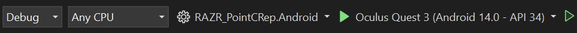

# RAZR Point Cloud Representation - RAZR_PointCRep

## Table of Contents
- [About](https://github.com/LorelaiDavis/RAZR_PointCRep?tab=readme-ov-file#about)
- [Getting Setup](https://github.com/LorelaiDavis/RAZR_PointCRep?tab=readme-ov-file#getting-setup)
  - [Headset setup](https://github.com/LorelaiDavis/RAZR_PointCRep?tab=readme-ov-file#headset-setup)
  - [Software setup](https://github.com/LorelaiDavis/RAZR_PointCRep?tab=readme-ov-file#software-setup)
  - [Opening & Running the project](https://github.com/LorelaiDavis/RAZR_PointCRep?tab=readme-ov-file#opening-the-project)
- [Features](https://github.com/LorelaiDavis/RAZR_PointCRep?tab=readme-ov-file#features)
- [FAQ](https://github.com/LorelaiDavis/RAZR_PointCRep?tab=readme-ov-file#faq)

## About
RAZR_PointCRep is a simple VR application for turning pcd file data into visible 3d point clouds. The application uses the open source library [Stereokit](https://github.com/StereoKit/StereoKit)<br>
Made June 2nd - August 9th 2025 for summer internship by Lorelai Davis

## Getting setup
#### Headset setup
> Note : These are required to install applications on specifically on the Meta Quest
1. Join/Create an organization for meta quest account
2. Enable developer mode 
   - Settings > Advanced Settings > Enable developer settings
#### Software setup
> More in-depth instruction can be found on [meta](https://developers.meta.com/horizon/documentation/native/android/mobile-device-setup) & [Stereokit's own website](https://stereokit.net/Pages/Guides/Getting-Started.html)
1. **Install adb via**
   - [Meta developer website](https://developers.meta.com/horizon/documentation/native/android/mobile-device-setup#install-the-oculus-adb-drivers-windows-only)
   - [Android developer website](https://developer.android.com/tools/adb)
   - Using [Chocolatey](https://chocolatey.org/install) and installing via command line
      ````
      choco install adb
      ````
2. **Install .NET sdk**
      ````
      winget install Microsoft.DotNet.SDK.9
      ````
3. **Install Visual Studio 2022**
   <br>**Make sure to install the workloads**<br>
   - Azure development
   - .Net multiplatform app UI Development
   - .Net desktop development
   <br>**++Individual Components**<br>
   - USB device connectivity
#### Opening the project
1. Copy this github repository onto your computer
2. Locate the RAZR_PointCRep.Android.csproj in file explorer and open in visual studio
   - enable show all files if not all files are appearing in the code editor
3. If everything is set up correctly you should be able to run in in the editor


## Features
**This project has 3 main features**
1. ShowPointCloud
   - Creates a point cloud using a model or from a pcd file (binary of ascii)
   - Adjustable point cloud size, point size, & ability to switch between perspective and fixed
   - HTML loading option to get pcd data from website
2. ShowModel
   - Prints model into world you can grab & move around
3. Spatial Anchors
   - User can manually place spatial anchors into the world for digital objects to be placed at

## FAQ
### My visual studio isn't showing an option for me to run
  That's alright! There are other ways to install the application into the headset both include creating an apk file of our android csproj<br>
  you can use adb install via command line
  ````
  adb devices
  # check out device is recognized
  adb install .\path\to\file\RAZR_PointCRep.apk
  ````
  or you can use the [Meta Quest Developer Hub](https://developers.meta.com/horizon/downloads/package/oculus-developer-hub-win/), my personal reccomendation out of the two
### Which files do what
#### Program.cs
  - Think of this almost as your "main class", stuff implemented here will stay throughout the entire play time. This is where spatial anchors and passthrough are called
#### [Program Classes folder](https://github.com/LorelaiDavis/RAZR_PointCRep/tree/main/Projects/Android/Program%20Classes)
  - These contain classes implementing the IClass interface that will appear in the class menu when using the application
#### [Spatial Anchor folder](https://github.com/LorelaiDavis/RAZR_PointCRep/tree/main/Projects/Android/Spatial%20Anchor)
  - Contains all files related to spatial anchors
#### [Tools folder](https://github.com/LorelaiDavis/RAZR_PointCRep/tree/main/Projects/Android/Tools)
  - Files such as IClass, Menu Sort for the Asset Menu's, and PassthroughFBExt to enable passthrough on the meta quest
